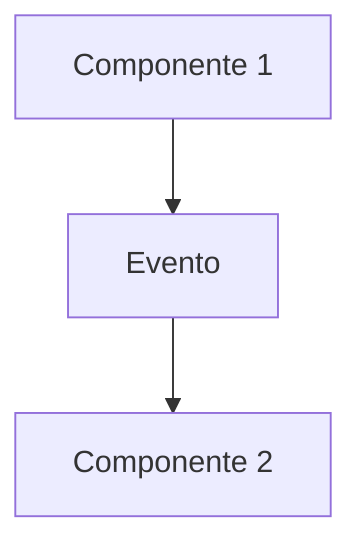
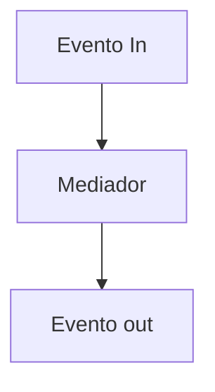
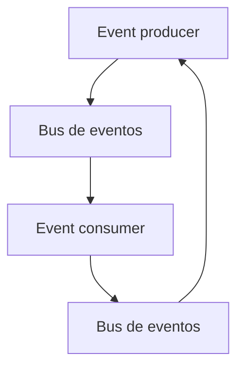

Son las siglas de **Arquitectura Basada en Eventos**
Hace uso de **Eventos** para desacoplar y desencadenar la comunicación entre los distintos componentes o servicios del sistema.

Podemos definir el **Evento** como un cambio en el estado del sistema o una actualización del mismo.

[[Topología]]:

**Broker**:

Los eventos se desencadenan de forma secuencial, lo que  permite tener un alto nivel de sensibilidad en el sistema con un buen performance.

Aquí los eventos se distibuyen de manera encadenada

Ventajas:
- Desacoplamineto
- Escalabilidad
- Rendimiento
- Extensibilidad

Desventajas:
- Sin flujo de control
- Manejo de errores
- Recuperabilidad y reinicio de flujo
- Inconsistencia en datos

**Mediador**:

Todos los eventos se comunican por medio de un componente central como lo es el **Mediador**, lo cual permite un mayor control sobre el flujo

Ventajas:
- Control del flujo
- Manejo de errores
- Recuperabilidad
- Reinicio
- Consistencia en datos

Desventajas:
- Acoplamineto entre procesadores
- Menor escalabilidad
- Menor tolerancia a fallos

----

Si uno de los requerimiento es la parte de comunicación síncrona se puede ocupar una comunicación pseudosíncrona por medio de **Request-Reply** como en el siguiente diagrama:

Esto haciendo uso de un ID y un ID de correlación

---

Se recomienda ocuparla cuando:
- Sistemas altamente escalables
- Integración de multiples aplicaciones o servicios
- Latencia baja y tolerante a fallos
- Flexibilidad y adaptabilidad para la evolución del sistema
- Manejo de arquitecturas hibridas

No se recomienda ocuparla cuando:
- Proyectos pequeños o de corta duración
- Experiencia limitada en estas arquitecturas
- Dependencias fuertes entre componentes
- Consistencia de datos en "tiempo real"