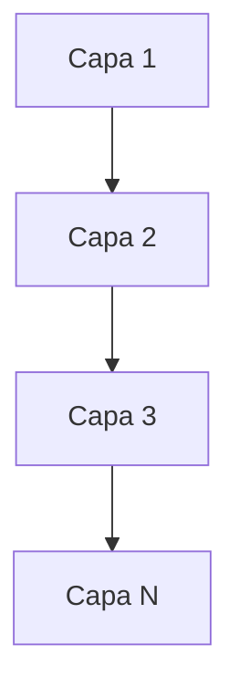
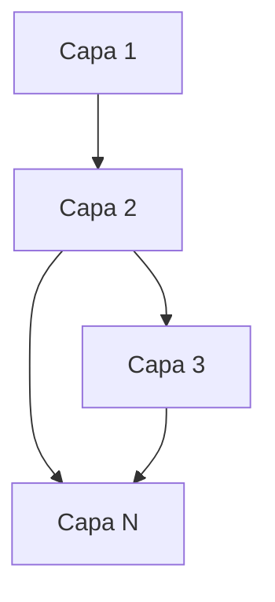

Ventajas:
- Sencillo de entender
- Sencillo de ejecutar
- Implementación barata

[[Topología]]:

Variaciones:
- Capa Abierta

Esta opción se debe utilizar con cuidado ya que incrementa el costo del desarrollo

Se recomienda ocuparla:
- Cuando no se sabe que arquitectura ocupar
- Cuando se tenga que desarrollar con bajo costo
- Cuando la reutilizacion no sea tan importante
- Cuando se necesite una arquitectura simple
- Cuando la aplicación sea pequeña

No se recomienda ocuparla:
- Cuando se necesite dividir el trabajo entre muchas personas
- Cuando el sistema tenga que escalar gradualmente
- Cuando no se necesite muy alta disponibilidad
- cuando se necesite alta modularidad