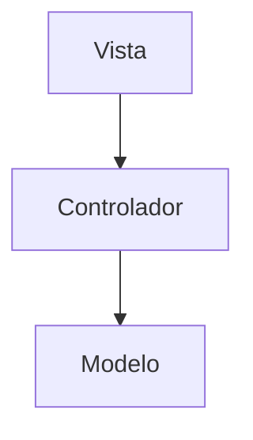
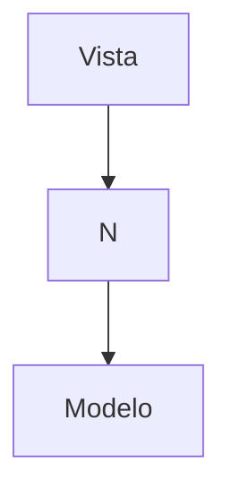

Es un [[Patrones de arquitectura]] que estructura el sistema en 3 componentes con responsabilidades claras.

Representada de la siguiente forma:

*Donde la Vista necesita pasar por el Controlador para obtener la información del Modelo*

Las responsabilidades de cada uno son:
- **Vista**: Se encarga de la representación externa de la información, esta puede ser una UI o una interfaz que permita compartir la información.
- **Controlador**: Es la que se encarga de controlar y dirigir el sistema, conecta la Vista con los datos del Modelo.
- **Modelo**: Es la encargada de encapsular toda la capa de negocio, junto con el acceso las fuentes de datos.

Variantes:
- **MV**** : Es similar a [[MVC]] pero en lugar de tener 1 solo controlador puede tener **N** controladores con sus variaciones y su representación es:

