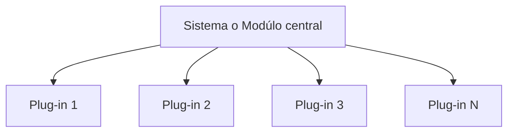

También se le conoce como **Micro-núcleo**

Es la arquitectura que ocupan la mayoría si no es que todos los editores de código en la actualidad, también se puede ocupar en sistemas que tengan muchas variasíones

[[Topología]]:

*Nota: Cada uno de los componentes puede tener su propia arquitectura definida*

Se recomienda ocuparla:
- Cuando vayas a distribuir software y quieras mejorarlo despúes
- Cuando quieras que sea muy extensible
- Cuando el caso de negocio tenga muchas variaciones
- Cuando la funcionalidad central pueda servir para muchos casos
- Cuando quieras una arquitectura más o menos simple

No se recomienda ocuparla:
- Cuando el performance sea **MUY** importante
- Cuando la tolerancia a fallos sea **MUY** importante
- Cuando la escalabilidad sea **MUY** importante