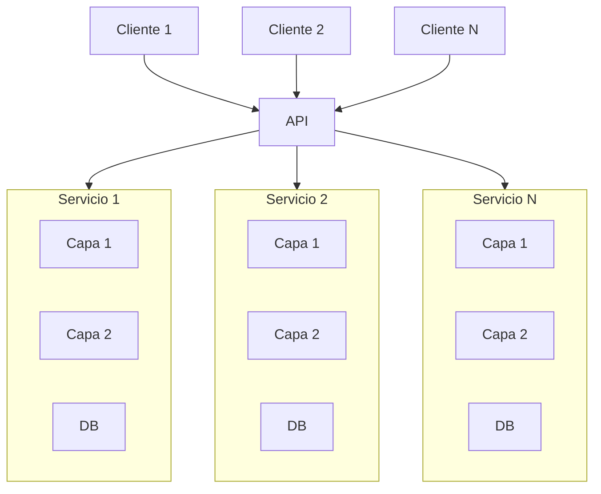

Se caracteriza por la independencia de cada uno de los **Servicios**, los cuales son gestionados por una API que los manda a ejecutar dependiendo de las peticiones de los clientes.
Los **Servicios** deben ser lo mas acotados posibles 

[[Topología]]:

Se recomienda ocuparla:
- Cuando el dominio cambia muy rapido
- Cuando la tolerancia al fallo sea MUY importante
- Cuando la modularidad sea importante
- Cuando la reusabilidad sea importante
- Cuando quieras evolucionar partes independietes del software

No se recomienda ocuparla:
- Cuando los recursos sean escasos
- Cuando quieras una arquitectura simple
- Cuando el rendimiento sea MUY importante