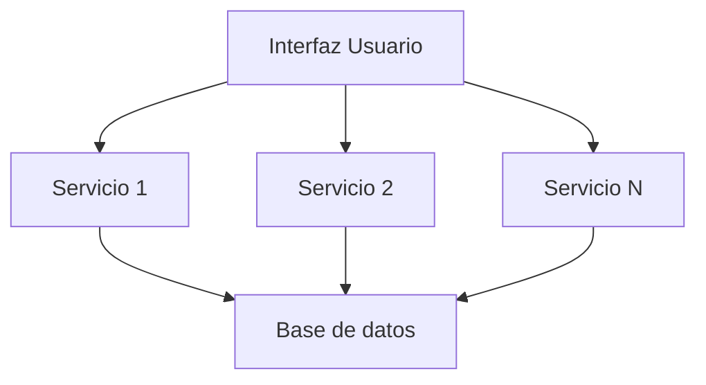
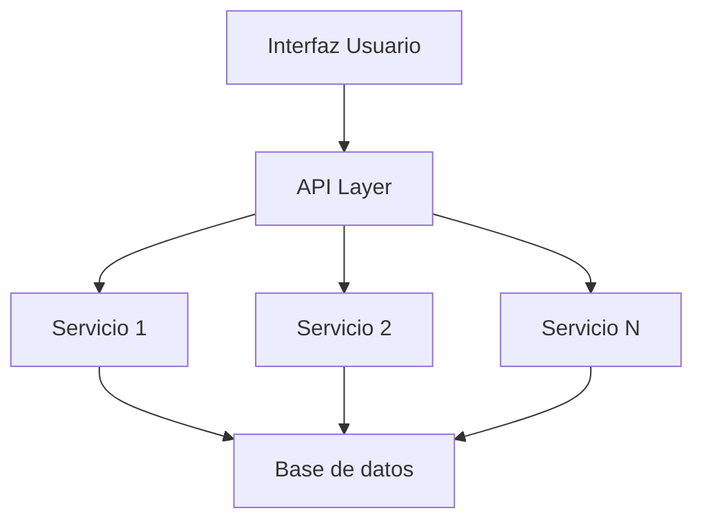
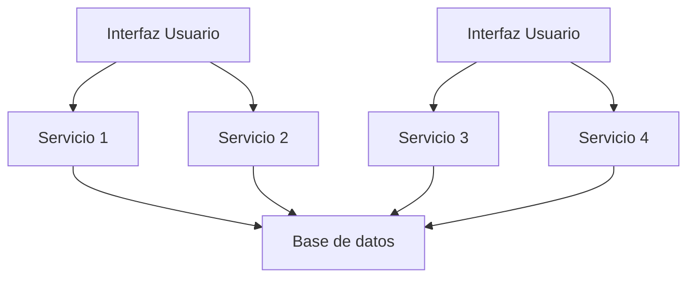
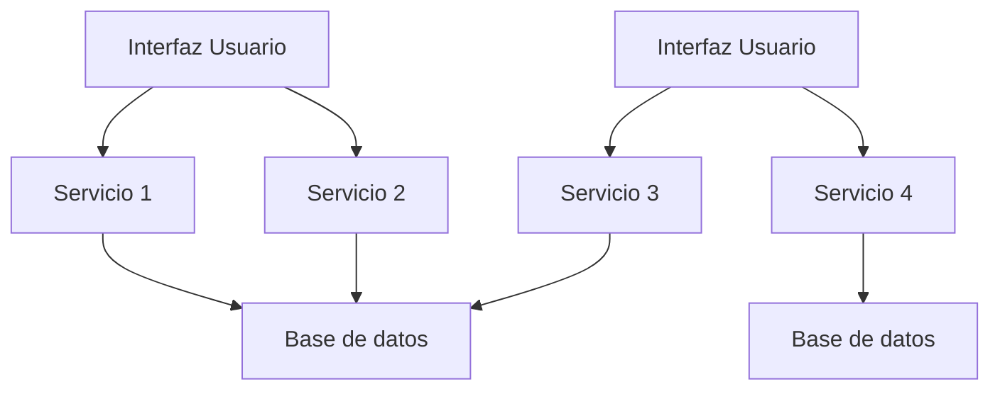
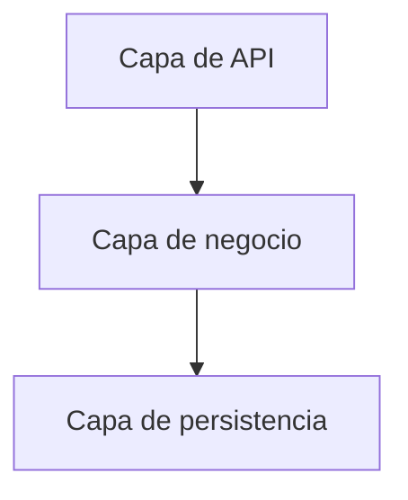
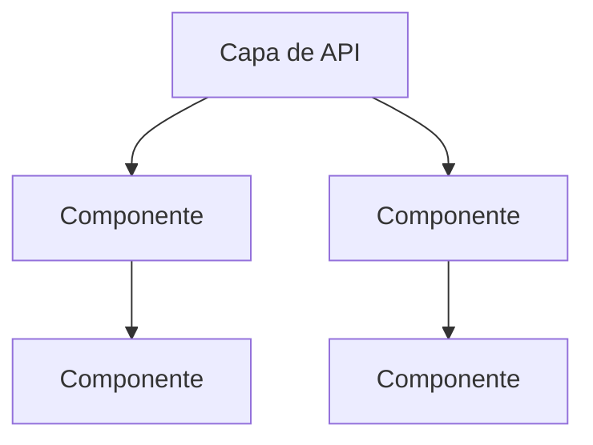
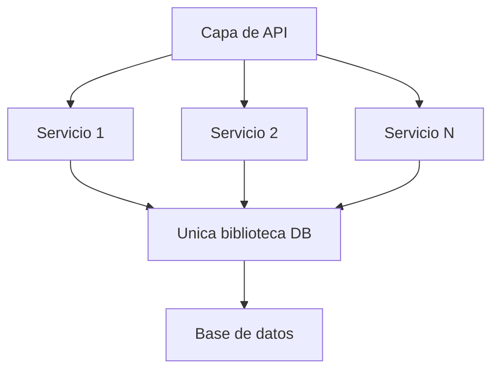
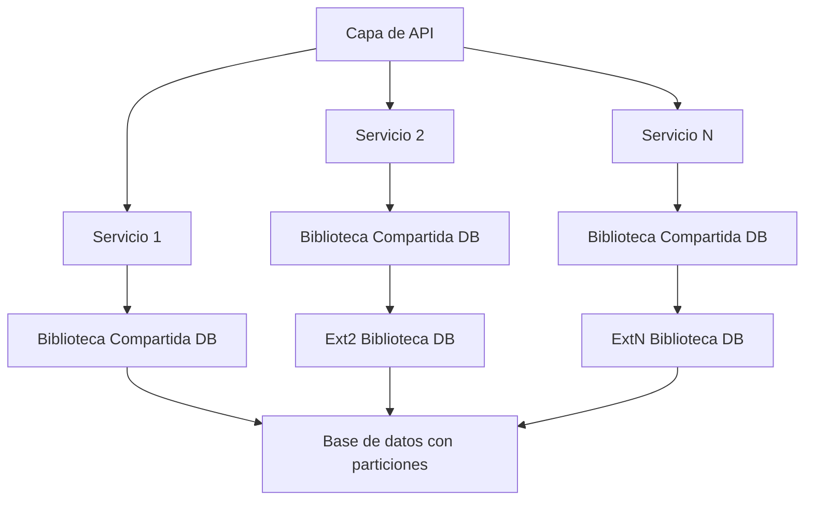

Son las siglas de **Arquitectura Orientada a Servicios**.

Los **Servicios** pueden ser componentes o flujos que sirven de apoyo para ejecutar o desarrollar cierta funcionalidad.

[[Topología]]:

**Variantes:**

- Separación por servicio

- Separación de dominio

- Separación por servicio y dominio

---

**Granularidad en los servicios:**

A diferencia de [[Microservice]], aquí los **Servicios** son mas grandes por la necesidad de abarcar una funcionalidad completa de dominio.

La [[Topología]] de estos puede ser:

**Por Capas:**

**Por Dominio:**

---
**Consideraciones**
Por la naturaleza de este [[Estilo arquitectónico]] puede darse que la Base de datos se corrompa, para evitar esto es recomendable realizar una partición de la base de datos, desarrollar una interfaz común para todos los servicios y adicional desarrollar interfaces especificas para que cada servicio, dependiendo de sus necesidades, pueda acceder a alguna de las particiones de escritura o lectura, como en los siguientes diagramas:

**Sin Particionamiento:**

**Con Particionamiento:**

---

Se recomienda ocuparlo cuando:
- Proyecto de largo plazo y la mantenibilidad es importante
- Modernización de monolitos o sistemas legacy
- Reutilización e interoperabilidad de componentes
- Cuando el diseño del sistema esta basado en el dominio
- Cuando la modularidad tiene mayor relevancia que la granularidad

No se recomienda ocuparlo cuando:
- Proyectos pequeños o de corta duración
- Experiencia limitada en esta arquitectura
- Requerimiento no requieren ser desacoplados
- Consistencia de datos en "tiempo real"